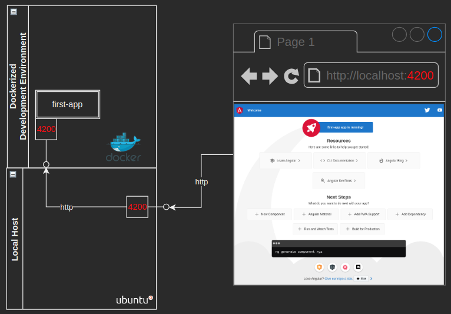

# Aprendiendo Angular

Este proyecto hace usode [.devcontainer](https://code.visualstudio.com/docs/remote/containers) para configurar el ambiente de desarrollo.

Expone el puerto 4200 entre el contenedor y tu máquina local.

Una explicación más detallada en:  [https://alejandroleon09.medium.com/primer-proyecto-angular-3c6207259878](https://alejandroleon09.medium.com/primer-proyecto-angular-3c6207259878)